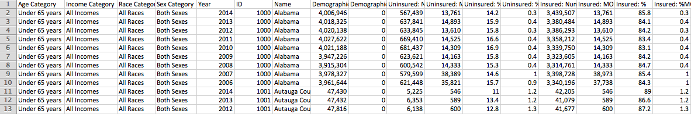
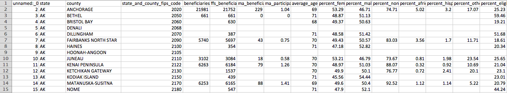
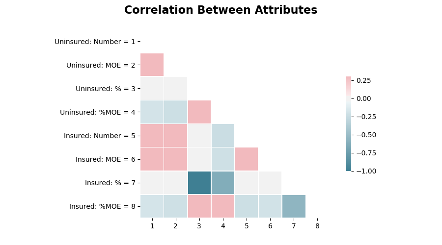
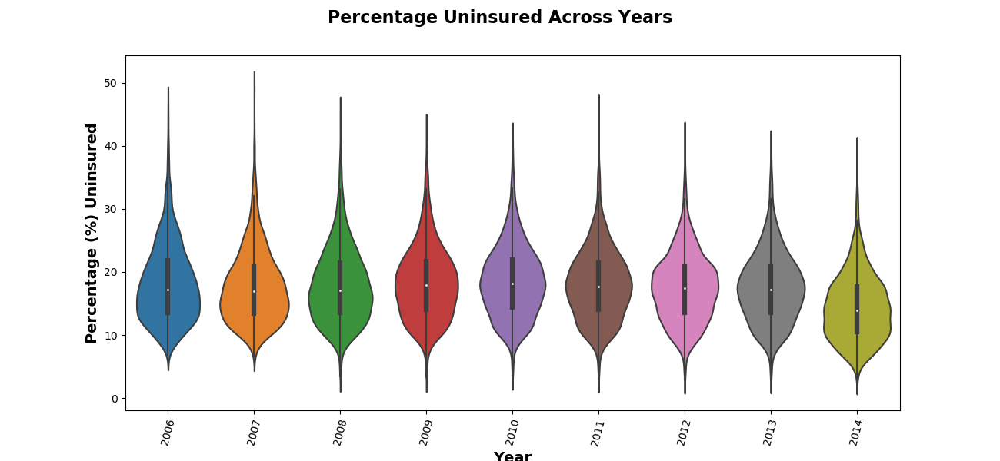
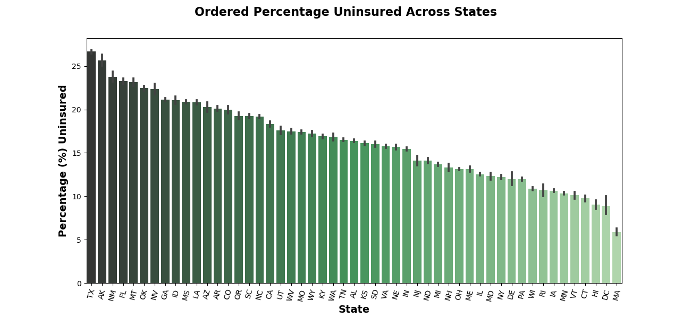
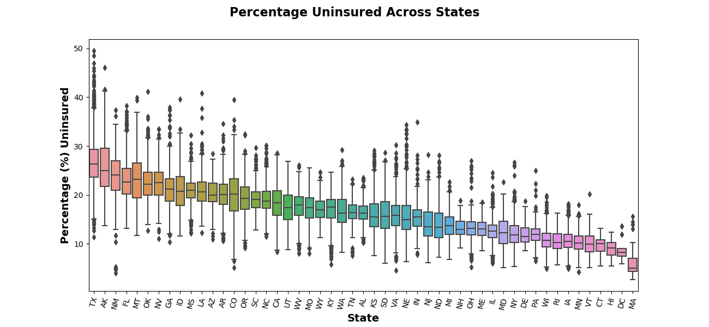

# Medicare Spending Across the United States

### Overview

The [data](https://github.com/brendan-drew/County-Medicare-Spending/tree/master/data) that I used for this analysis is composed of various measures of health care in the United States, measured for the counties of each state.

There were quite a few data sets to choose from, the two I settled on are described below

##### Inference Data Set

With a little over 28,000 rows and 13, the only cleaning I had to do on this data set was drop the first four columns you can see (one group per column, not adding any information to the data), and change the name column to be only states.



##### Prediction Data Set

With 25,000 rows and 221 columns, this data set has a lot of NaN's. After toying around with the idea of imputing column means for missing values, I decided to drop all rows that had any NaN's in them. My reasoning for this decision was that, while this does cut my data down to roughly a third of what it was, since the purpose of this data set will be prediction, I would rather have the precision of my model decline due to the lack of data than have it artificially increase due to reducing the noise in each column by imputing the mean. In the end, I still ended up with 8,800 rows.



### Guiding Questions/Goals

My analysis was guiding by the following:

1. Is there a statistically significant difference in the percentage of uninsured individuals across states?

2. Has there been a statistically significant change in the percentage of uninsured from year to year (2006 - 2014)?

3. Predict predict total cost per beneficiary.


### Hypothesis Tests

Although, I will be predicting on a different data set, before setting out to answer my two inferential questions, I decided to view a correlation matrix to get a sense of how my data behaved (I decided not show a similar plot for my prediction matrix due to the dimension size). The only thing to note is that, as expected, the percent uninsured and the percent insured are perfectly negatively correlated.



Moving forward, for both hypothesis tests, *my significance level will be 0.05*.

#### Question

Has there been a statistically significant change in the percentage of uninsured individuals from year to year (2006 - 2014)?

* *Null Hypothesis: There is no significant difference between the average percentage of uninsured individuals from year to year*

* *Alternative Hypothesis: At least one of the years have a different average percent of uninsured individuals than the other years*

##### Visual Exploration



##### Statistical Exploration

Although visually it seems unnecessary to prove this statistically, when I *did* perform ANOVA on this data, the result was rather shocking.

Calculated in Python using `scipy.stats.f_oneway`, by passing the arrays of the Uninsured: % for each year, an F-Statistic of **153** is returned, with a corresponding P-Value far below my level of significance.

With a little disbelief, I turned to R to confirm these findings, reproduced below.

```
year_anova <- aov(percent_uninsured ~ year, data = df)
summary(year_anova)

               Df | Sum Sq | Mean Sq | F value | Pr(>F)    
year            8   38660     4833      153.2    <2e-16 ***
Residuals   28722   906120     32                   
---
Signif. codes:  0 ‘***’ 0.001 ‘**’ 0.01 ‘*’ 0.05 ‘.’ 0.1 ‘ ’ 1
```

To be conservative, I decided to use an effect size of 0.05 (*half* that recommended by Cohen for small effect sizes) and calculate the power of my test in R as well, the result of which is reproduced below.

```
Balanced one-way analysis of variance power calculation

              k = 9
              n = 3192
              f = 0.05
      sig.level = 0.05
          power = 0.99
```

Looking further at *which* years have a significant difference, we get the following (Note that **I omitted all comparisons to 2014** from the below table; all the P-Values were effectively zero and I wanted to show the other comparisons as well)

```
2013-2010       3.320e-10  
2012-2010       5.573e-10  
2010-2007       6.386e-07  
2013-2009       3.483e-05  
2012-2009       5.066e-05  
2013-2006       8.212e-05  
2012-2006       1.178e-04  
2010-2008       3.271e-04  
2011-2010       5.094e-03  
2009-2007       6.502e-03  
2007-2006       1.220e-02
```

Although shocking, with 3100 observations per year, and variance that was roughly 1% of that (~30), it becomes clear that even if the difference between years is small, our confidence in that difference is high due to a very small standard error.

#### Question

Is there a statistically significant difference in the percentage of uninsured individuals across states?

* *Null Hypothesis: There is no significant difference between the means of the percentage of the population uninsured across states (Washington, D.C as separate state).*

* *Alternative Hypothesis: At least one of the states have a higher mean percent uninsured than the other states*

##### Visual Exploration





##### Statistical Exploration

With an F-Statistic of `1013` and a corresponding P-value well below our significance level, we can reject the null hypothesis and accept that there truly is a difference in the percent of uninsured individuals across states.

```
state_anova <- aov(percent_uninsured ~ state, data=df)
summary(state_anova)

               Df | Sum Sq |  Mean Sq | F value | Pr(>F)    
state          50   603282    12066      1013    <2e-16 ***
Residuals   28680   341498     12                   
---
Signif. codes:  0 ‘***’ 0.001 ‘**’ 0.01 ‘*’ 0.05 ‘.’ 0.1 ‘ ’ 1
```

### Modeling

I decided to create a new feature for prediction, which I called **Cost per Beneficiary**. This was calculated by dividing the Beneficiaries with Part A and Part B coverage by the Total Actual Costs.

* Part A Coverage = Inpatient expenses (hospitalization, etc)
* Part B Coverage = Outpatient expenses (doctor visits, etc.)


* **Cost per Beneficiary = Beneficiaries with Part A and Part B / Total Actual Costs**

#### General Workflow

1. Determine the models I wanted to try

    * Ridge, Lasso, Linear Regression

2. Tune the regularization parameter (alpha) for both Ridge and Lasso Regression

    * 10-Fold cross-validation for each of 100, 10, 5

        --> 10-Fold cross-validation for each of 4, 3, 2, 1

        --> magic alpha = **2**

3. Average the RMSE of 10-Fold cross-validation for Ridge Regression, Lasso Regression (both with alpha = 2) and Linear Regression, the results of which are below.

```
Lasso Regression - 148.280
Linear Regression - 122.606
Ridge Regression - 124.374
```

Although Lasso does have the "worst" RMSE, I decided to choose that model since it was able to reduce the predictors from over 200 down to 53. For future applications this would mean that one could decreases the number of attributes that need to be measured by roughly 75%, while only increasing the RMSE by $26 per beneficiary.

On the test set, the Lasso Regression model was off by almost the same amount as the cross validated RMSE, with a test RMSE $148.13. The first few predictions on the test set are printed alongside the actual values below.

**The interpretations of this that my model will be roughly $148 off of the true cost per beneficiary that has part A and part B coverage, per county.**

```
    Actual  | Predicted
0  $7538.19 | $7601.56
1   $7488.2 | $7634.26
2  $7593.14 | $7697.01
3  $4062.92 | $4214.87
4   $7057.5 | $7025.31
5  $6885.39 | $7177.14
```

The predictors with the largest coefficients (positive or negative), were all some component of Total Actual Costs, an obvious influencer of my response since that was used in the feature engineering. However, interestingly, the fifth lowest coefficient (shown below) is the Percent of Medicare fee-for-services beneficiaries who are not hispanic-white.

Holding all else constant, a one unit increase in the Percent of Medicare fee-for-services beneficiaries who are not hispanic-white would decrease the predicted cost per beneficiary by $19.52

```
                    Attribute  | Coefficient
    percent_non-hispanic_white | -19.52
```
