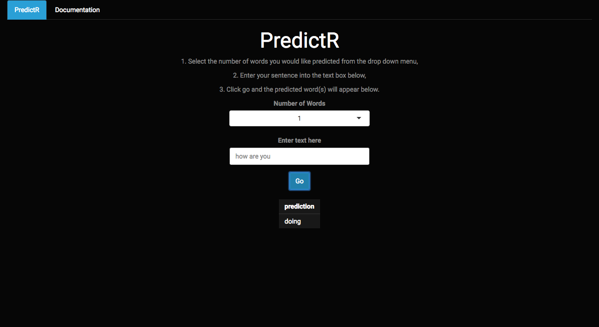

<html>
    <head>
        
    </head>
</html>

PredictR
========================================================
author: Marshall McQuillen
date: December 20, 2017
transition: concave
font-family: Times New Roman

Shiny Application
========================================================
<small>
<small>
<small>
[PredictR](https://marshallm94.shinyapps.io/Word_Prediction/) is my Shiny word prediction application for the John Hopkins University Data Science Specialization, put on by Coursera. Directions are provided on the main page of the application, shown below.
</small>
</small>
</small>

Stupid Backoff Description
========================================================
<small>
<small>
<small>
Stupid Backoff (the mathematical details of which can be found [here](http://www.aclweb.org/anthology/D07-1090.pdf)) is an algorithm that satisfies the Markov Property, which states that the probability of an event given its full history of previous events is *roughly* equal to the probability of the event given it's present state.

In terms of word prediction, this means that we can predict the next word in a sequence based on the previous few words with roughly the same accuracy as if we based our prediction on the entire preceding sentence.

Stupid Backoff does precisely this. It looks at the previous *n* words, called an *ngram*, checks the data set to see if there are any matches to that sequence, and, if there are, it chooses the next word with the highest count, given that previous sequence. If no matches are found, it goes "down" one level, to the (n - 1)gram, and repeats the process.
</small>
</small>
</small>
Performance
========================================================
<small>
<small>
<small>
After I built the blueprint for my model, I used the incredibly informative [benchmark.R repo](https://github.com/hfoffani/dsci-benchmark) to test a few different models and sample sizes.

Each model employs the Stupid Backoff Algorithm explained in the previous slide. I started with a 6 gram model using 25% of the data provided (randomly selected), and then compared that with a 4 gram model with 33% of the data, a 4 gram model with 25% of the data and finally a 5 gram model with 25% of the data. The results for 28,464 predictions on each model are show below...
 
 
<table class="table table-bordered" style="font-size: 18px; margin-left: auto; margin-right: auto;">
<thead><tr>
<th style="text-align:left;"> model </th>
   <th style="text-align:left;"> sample_size </th>
   <th style="text-align:left;"> Overall_top_3 </th>
   <th style="text-align:left;"> Top_1_Precision </th>
   <th style="text-align:left;"> Top_3_Precision </th>
   <th style="text-align:left;"> Average_runtime </th>
   <th style="text-align:left;"> Memory_Used </th>
  </tr></thead>
<tbody>
<tr>
<td style="text-align:left;"> 6 Gram </td>
   <td style="text-align:left;"> 25% </td>
   <td style="text-align:left;"> 15.13% </td>
   <td style="text-align:left;"> 11.68% </td>
   <td style="text-align:left;"> 18.09% </td>
   <td style="text-align:left;"> 143.93 msec </td>
   <td style="text-align:left;"> 120.92 Mb </td>
  </tr>
<tr>
<td style="text-align:left;"> 4 Gram </td>
   <td style="text-align:left;"> 33% </td>
   <td style="text-align:left;"> 15.33% </td>
   <td style="text-align:left;"> 11.76% </td>
   <td style="text-align:left;"> 18.33% </td>
   <td style="text-align:left;"> 56.85 msec </td>
   <td style="text-align:left;"> 157.10 Mb </td>
  </tr>
<tr>
<td style="text-align:left;"> 4 Gram </td>
   <td style="text-align:left;"> 25% </td>
   <td style="text-align:left;"> 15.07% </td>
   <td style="text-align:left;"> 11.59% </td>
   <td style="text-align:left;"> 18.06% </td>
   <td style="text-align:left;"> 53.96 msec </td>
   <td style="text-align:left;"> 117.67 Mb </td>
  </tr>
<tr>
<td style="text-align:left;"> 5 Gram </td>
   <td style="text-align:left;"> 25% </td>
   <td style="text-align:left;"> 15.06% </td>
   <td style="text-align:left;"> 11.63% </td>
   <td style="text-align:left;"> 18.01% </td>
   <td style="text-align:left;"> 93.92 msec </td>
   <td style="text-align:left;"> 123.74 Mb </td>
  </tr>
</tbody>
</table>
 
 
From the table, we have clear proof that the model does in fact satisfy the Markov Property from the previous slide (the precision of the 6 gram model is actually worse than that of the 4gram model). I decided to use the 4gram model with a 25% sample of the data as my final model. A 25% reduction in the memory used for the model is worth the 0.17% reduction in the Top 1 Word Precision in my opinion.

</small>
</small>
</small>
Final Thoughts
========================================================
<small>
<small>
<small>
*"Remember that all models are wrong; the practical question is how wrong do they have to be to not be useful"*  
--   George Box & Norman R. Draper, Empirical Model-Building and Response Surfaces

While language is clearly an ever-changing and highly dynamic area for computational processes, I can think of a few ways in which my model could be made "less wrong":

1. **Larger database** - I would be very interested to see how my model would perform if I had a machine powerful enough to process the entire corpus.

2. **User Specific Learning** - One thought I had while building my model was that since every person has an individual style of speaking (and therefore typing), I think it would be feasible to build functionality into the application that learns how the individual user types, theoretically making the model more accurate for the user the more they use it.

3. **Speed** - Although 53.96 milliseconds seems relatively quick, over time, that will become cumbersome to the user. Notably, on [this Coursera forum](https://www.coursera.org/learn/data-science-project/discussions/all/threads/1aWTuoCGEeakbhIiKPxV8w), there are a few users boasting average runtimes of single digit milliseconds. (Sincere applause to those users)

</small>
</small>
</small>
